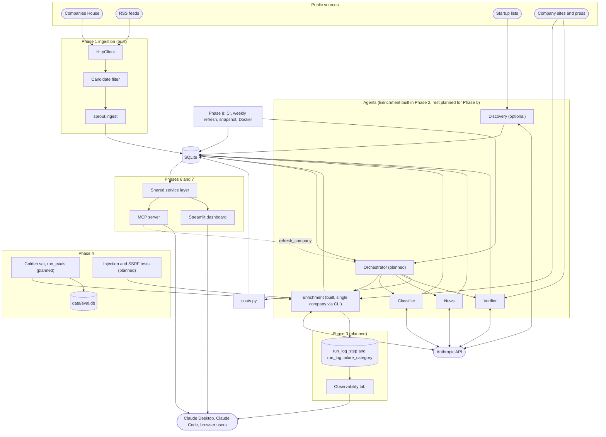

# End to end

Part of the [Sprout architecture docs](README.md). Composite diagram across all phases; see each phase's own page for detail.

```mermaid
flowchart TB
    subgraph SOURCES["Public sources"]
        CH(["Companies House"])
        RSSF(["RSS feeds"])
        LISTS(["Startup lists"])
        SITES(["Company sites and press"])
    end
    subgraph ING["Phase 1 ingestion (built)"]
        HTTPL["HttpClient"]
        CAND["Candidate filter"]
        INGEST["sprout.ingest"]
    end
    SQL[("SQLite")]
    subgraph PIPE["Agents (Enrichment built in Phase 2, rest planned for Phase 5)"]
        ORCH["Orchestrator (planned)"]
        ENR["Enrichment (built, single company via CLI)"]
        CLS["Classifier"]
        NEWS["News"]
        VER["Verifier"]
        DISC["Discovery (optional)"]
    end
    LLM(["Anthropic API"])
    COST["costs.py"]
    subgraph SERVE["Phases 6 and 7"]
        SVC["Shared service layer"]
        MCP["MCP server"]
        DASH["Streamlit dashboard"]
    end
    subgraph QA["Phase 4"]
        EVALS["Golden set, run_evals (planned)"]
        EDB[("data/eval.db")]
        GUARDS["Injection and SSRF tests (planned)"]
    end
    subgraph OBSG["Phase 3 (planned)"]
        STEPS[("run_log_step and run_log.failure_category")]
        OBSUI["Observability tab"]
    end
    CLIENTS(["Claude Desktop, Claude Code, browser users"])
    AUTO["Phase 8: CI, weekly refresh, snapshot, Docker"]
    CH --> HTTPL
    RSSF --> HTTPL
    HTTPL --> CAND
    CAND --> INGEST
    INGEST --> SQL
    SQL --> ORCH
    ORCH --> ENR
    ORCH --> CLS
    ORCH --> NEWS
    ORCH --> VER
    DISC --> SQL
    LISTS --> DISC
    SITES --> ENR
    SITES --> VER
    ENR <--> LLM
    CLS <--> LLM
    NEWS <--> LLM
    VER <--> LLM
    DISC <--> LLM
    ENR --> SQL
    CLS --> SQL
    NEWS --> SQL
    VER --> SQL
    ORCH --> COST
    COST --> SQL
    SQL --> SVC
    SVC --> MCP
    SVC --> DASH
    MCP -. "refresh_company" .-> ORCH
    MCP --> CLIENTS
    DASH --> CLIENTS
    ENR --> STEPS
    STEPS --> OBSUI
    OBSUI --> CLIENTS
    EVALS --> ENR
    EVALS --> EDB
    GUARDS --> ENR
    AUTO --> ORCH
    AUTO --> SQL
```
